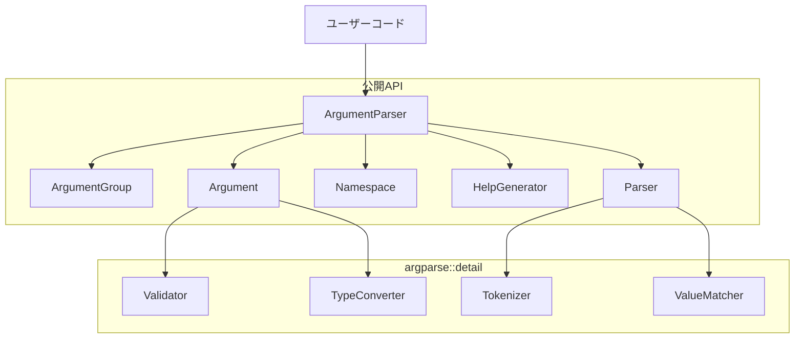

# 設計書

## 概要

argparse-coreは、PythonのargparseモジュールのコアAPIをC++で実装するヘッダオンリーライブラリの基盤となる設計です。単一のヘッダファイル`argparse.hpp`に全実装を含み、ArgumentParserクラスを中心に、引数の定義、解析、検証、ヘルプ生成の各機能を提供します。C++11の機能を活用しながら、Python argparseとの高い互換性を維持します。

## ステアリング文書との整合性

### 技術標準 (tech.md)
- **ヘッダオンリー設計**: 全実装を`argparse.hpp`単一ファイルに含める
- **C++11準拠**: テンプレート、型消去、RAII原則を活用
- **標準ライブラリのみ使用**: 外部依存を排除し、ポータビリティを最大化
- **テンプレートメタプログラミング**: 型安全性とゼロコスト抽象化の実現

### プロジェクト構造 (structure.md)
- **ネームスペース構成**: `argparse`公開API、`argparse::detail`内部実装
- **命名規則**: クラスはPascalCase、メソッドはsnake_case（Python互換）
- **ファイル構成**: pragma once、標準ライブラリインクルード、実装の順序
- **テスト構造**: Google Testを使用した単体テストと統合テスト

## コード再利用分析

### 活用する既存コンポーネント
- **std::string**: 文字列処理とバッファ安全性の確保
- **std::vector**: 引数リストの動的管理
- **std::map/unordered_map**: 引数名による高速検索
- **std::shared_ptr**: 内部データの共有とライフタイム管理
- **std::function**: カスタムバリデータとタイプコンバータ

### 統合ポイント
- **標準入出力**: std::cout/cerrによるヘルプとエラー出力
- **例外機構**: std::runtime_error/invalid_argumentによるエラー処理
- **型消去技術**: C++17以前でもstd::any相当の機能を実装

## アーキテクチャ

### モジュラー設計原則
- **単一ファイル責任**: 各内部クラスは特定の機能（引数、グループ、パーサー）を担当
- **コンポーネント分離**: 引数定義、解析ロジック、ヘルプ生成を独立して実装
- **サービス層分離**: 引数検証、値変換、出力フォーマットを別々の層で処理
- **ユーティリティモジュール性**: 文字列処理、型変換を独立したヘルパー関数に



## コンポーネントとインターフェース

### ArgumentParser
- **目的:** コマンドライン引数解析の主要なエントリポイント
- **インターフェース:**
  - `ArgumentParser(prog, description="", epilog="")`
  - `add_argument(name, ...options)`
  - `add_argument_group(title, description="")`
  - `parse_args(argc, argv)` / `parse_args(args)`
  - `format_help()`
- **依存関係:** Argument, ArgumentGroup, Parser, HelpGenerator
- **再利用:** std::map, std::vector, std::shared_ptr

### Argument
- **目的:** 個々の引数の定義と検証を管理
- **インターフェース:**
  - `set_name(name)`
  - `set_help(text)`
  - `set_type(converter)`
  - `set_default(value)`
  - `set_choices(values)`
  - `validate(value)`
  - `convert(value)`
- **依存関係:** TypeConverter, Validator
- **再利用:** std::function, std::any相当の型消去

### Namespace
- **目的:** 解析結果を保持し、型安全なアクセスを提供
- **インターフェース:**
  - `get<T>(name)`
  - `has(name)`
  - `operator[](name)`
  - `contains(name)`
- **依存関係:** なし（スタンドアロン）
- **再利用:** std::unordered_map, 型消去技術

### Parser（内部）
- **目的:** コマンドライン引数のトークン化と解析
- **インターフェース:**
  - `parse(argc, argv, arguments)`
  - `tokenize(argv)`
  - `match_argument(token, arguments)`
- **依存関係:** Tokenizer, ValueMatcher
- **再利用:** std::string, std::vector

### HelpGenerator
- **目的:** ヘルプメッセージの自動生成とフォーマット
- **インターフェース:**
  - `generate(parser, arguments, groups)`
  - `format_usage(prog, arguments)`
  - `format_arguments(arguments)`
- **依存関係:** Argument, ArgumentGroup
- **再利用:** std::stringstream, std::setw

## データモデル

### ArgumentDefinition
```cpp
struct ArgumentDefinition {
    std::vector<std::string> names;      // ["--verbose", "-v"]
    std::string help;                    // ヘルプテキスト
    std::string metavar;                 // ヘルプでの表示名
    std::string action;                  // "store", "store_true", etc.
    std::string type_name;               // "int", "float", "string"
    detail::AnyValue default_value;      // デフォルト値（型消去）
    std::vector<detail::AnyValue> choices; // 選択肢
    int nargs;                           // 引数の数（-1=任意）
    bool required;                       // 必須フラグ
    std::function<detail::AnyValue(const std::string&)> converter;
    std::function<bool(const detail::AnyValue&)> validator;
};
```

### ParsedValue
```cpp
struct ParsedValue {
    std::string name;                    // 引数名
    detail::AnyValue value;              // 解析された値（型消去）
    bool is_default;                     // デフォルト値かどうか
    
    template<typename T>
    T get() const;                       // 型安全な値取得
};
```

### AnyValue（型消去実装）
```cpp
namespace detail {
class AnyValue {
private:
    struct BaseHolder {
        virtual ~BaseHolder() = default;
        virtual BaseHolder* clone() const = 0;
        virtual const std::type_info& type() const = 0;
    };
    
    template<typename T>
    struct Holder : BaseHolder {
        T value;
        explicit Holder(const T& v) : value(v) {}
        BaseHolder* clone() const override { 
            return new Holder(value); 
        }
        const std::type_info& type() const override { 
            return typeid(T); 
        }
    };
    
    std::unique_ptr<BaseHolder> holder;
    
public:
    template<typename T>
    AnyValue(const T& value);
    
    template<typename T>
    T get() const;
    
    bool has_value() const;
};
}
```

## エラー処理

### エラーシナリオ

1. **必須引数の欠落**
   - **処理:** `std::runtime_error`をスロー
   - **ユーザー影響:** `error: the following arguments are required: [name]`

2. **不正な型変換**
   - **処理:** `std::invalid_argument`をスロー
   - **ユーザー影響:** `error: argument [name]: invalid [type] value: '[value]'`

3. **不明なオプション**
   - **処理:** `std::runtime_error`をスロー
   - **ユーザー影響:** `error: unrecognized arguments: [args]`

4. **選択肢外の値**
   - **処理:** `std::invalid_argument`をスロー
   - **ユーザー影響:** `error: argument [name]: invalid choice: '[value]' (choose from [choices])`

5. **引数の数の不一致**
   - **処理:** `std::runtime_error`をスロー
   - **ユーザー影響:** `error: argument [name]: expected [n] arguments`

## テスト戦略

### 単体テスト
- **ArgumentParserテスト**: 初期化、引数追加、グループ作成
- **Argumentテスト**: 各種パラメータ設定、検証ロジック
- **Parserテスト**: トークン化、引数マッチング、値解析
- **TypeConverterテスト**: int, float, bool, string変換
- **HelpGeneratorテスト**: ヘルプメッセージフォーマット

### 統合テスト
- **Python互換性テスト**: 同じ入力でPython argparseと同じ結果
- **複雑な引数構成**: サブコマンド、グループ、相互排他の組み合わせ
- **エラーケース**: 全てのエラーシナリオの動作確認

### エンドツーエンドテスト
- **実際のCLIツール**: サンプルアプリケーションの完全動作
- **ヘルプ表示**: --helpオプションの出力確認
- **エラーメッセージ**: ユーザーフレンドリーなエラー表示